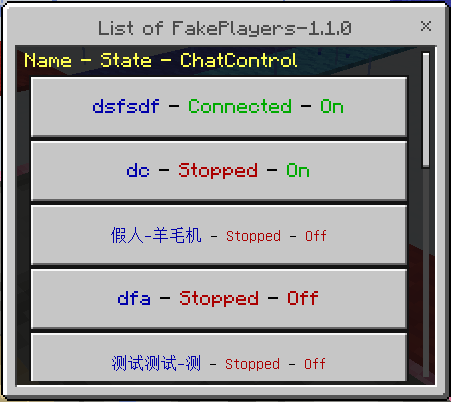
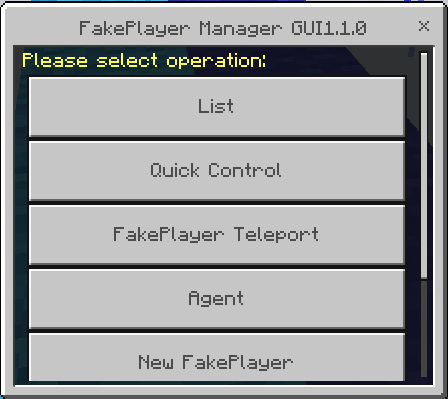
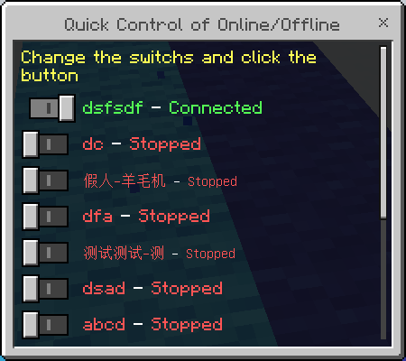

# FakePlayerManager

Fake Player Manager - A Fake Player Manager plugin with GUI, also linked with [Operation Agent Plugin](https://www.minebbs.com/resources/operation-agent.2941/) function (need to download extra to enable the corresponding function), please use it with [FakePlayer](https://github.com/ddf8196/FakePlayer) of [ddf8196](https://github.com/ddf8196)

[中文](README_cn.md) | English

## Introduction

This plugin is a FakePlayer management plugin with GUI interface, supports [FakePlayer](https://github.com/ddf8196/FakePlayer)-0.4.0 or later, also provides [operation-agent plugin](https://www.minebbs.com/) resources/operation-agent.2941/) for easy operation

* Example Screen.





## Installation

1. Go to [MineBBS](https://www.minebbs.com/resources/fakeplayermanager-gui.2945/) to download the plugin
2. Unzip the plugin and copy the contents to the plugins folder in the Minecraft Dedicated Server directory
3. modify the configuration file (optional)
4. Start the server


## Use - GUI
|Commands|Description|
|-|-|
|fpg |open the default screen|
|fpg **h**/**help** |opens the help information screen|
|fpg **a**/**agent** |opens the Fake Player agent screen (requires the [Operation Agent Plugin](https://www.minebbs.com/resources/operation-agent.2941/) to be installed)|
|fpg **m**/**menu** |opens the menu screen|
|fpg **q**/**quick** |opens the Fake Player online status quick management screen|
|fpg **list** |opens the Fake Player list screen|
|fpg **add** |opens the Add Fake Player screen|


## Use - CMD
|command|description|
|--|--|
| fpg |open the Fake Player management GUI |
| fpm **? **/**h**/**help** | show this message |
| fpm **g**/**gui** | Fake Player management GUI, same as /fpg |
| fpm **l**/**list** | Get the list of Fake Players |
| fpm **a**/**add** name | Add a Fake Player |
| fpm **r**/**remove** name | remove Fake Player |
| fpm **s**/**state** name | Get Fake Player state |
| fpm **ls**/**listState** | List all Fake Player states |
| fpm **c**/**connect** name | Connect Fake Players |
| fpm **d**/**disconnect** name | Disconnect connection |
| fpm **ra**/**removeAll** | Remove all Fake Players |
| fpm **ca**/**connectAll** | Connect all Fake Players |
| fpm **da**/**disconnectAll** | Disconnect all Fake Players |

## Supported Versions

* Minecraft Dedicated Server 1.17.10.04 with [LiteLoaderBDS](https://www.minebbs.com/resources/liteloader.2059/) 1.1.1 or above


## Configuration file (config.json)

```jsonc
{
    "configVersion": 1,         // config file version, used for different versions of configuration files compatible with updates, do not modify
    "wsurl": "ws://localhost",  // Fake Player client's WebSocket server address, generally do not need to modify
    "port": 54321,              // the Fake Player client's WebSocket server port
    "allowRemoveAll": false,    // whether to allow the removal of all Fake Player commands (to prevent misuse)
    "defaultGui": "menu",       // the default window, i.e. the window without any parameters
    "language": "zh_CN",        // language, currently available: zh_CN, en_US, contributions welcome
    "permissionLevel": 1,       // the minimum permission level allowed by the command, 0 is for all users, 1 is for administrators
    "debugMode": false,         // debug mode
    "color": true,              // global color switch
    "consoleColor": true,       // Console color switch
}
```

## Caution
* The list of Fake Players will be sorted by last online time.

* This plugin function requires [FakePlayer Client](https://github.com/ddf8196/FakePlayer) to enable WebSocket function in order to work properly.

* This plugin will automatically detect whether [Operation Proxy Plugin](https://www.minebbs.com/resources/operation-agent.2941/) is installed or not, the related function is only available in the server where Operation Proxy Plugin is installed, if you want to use the related function, please download and install Operation Proxy Plugin.

* Welcome to provide suggestions and feedback if you have any questions.


Translated with www.DeepL.com/Translator (free version)