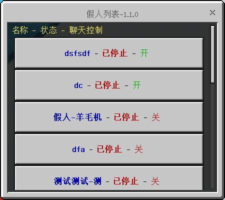
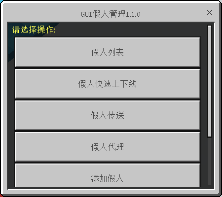
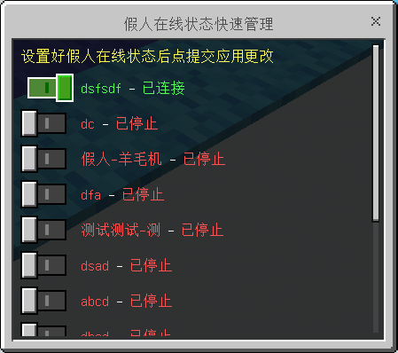

# FakePlayerManager

假人管理 - 一款带GUI的假人管理插件，同时联动 [操作代理插件](https://www.minebbs.com/resources/operation-agent.2941/) 功能（需要额外下载才能启用相应功能）请配合 [ddf8196](https://github.com/ddf8196) 的 [FakePlayer](https://github.com/ddf8196/FakePlayer) 使用

Chinese | [English](README.md)

## 简介

此插件为假人带GUI界面的假人管理插件，支持 [FakePlayer](https://github.com/ddf8196/FakePlayer)-0.4.0 或更新版本，同时提供 [操作代理插件](https://www.minebbs.com/resources/operation-agent.2941/) 的便捷操作

* 示例界面：





## 安装

1. 前往 [MineBBS](https://www.minebbs.com/resources/fakeplayermanager-gui.2945/) 下载插件
2. 将插件压缩包解压并将内容复制到 Minecraft Dedicated Server 目录下 plugins 文件夹中
3. 修改配置文件（可选）
4. 开服


## 使用 - GUI
|指令|说明|
|-|-|
|fpg           |打开默认界面|
|fpg **h**/**help**    |打开帮助信息界面|
|fpg **a**/**agent**   |打开假人代理界面（需安装[操作代理插件](https://www.minebbs.com/resources/operation-agent.2941/) ）|
|fpg **m**/**menu**    |打开菜单界面|
|fpg **q**/**quick**   |打开假人在线状态快速管理界面|
|fpg **list**      |打开假人列表界面|
|fpg **add**       |打开添加假人界面|


## 使用 - CMD
|指令|说明|
|--|--|
| fpg                             | 打开假人管理GUI      |
| fpm **?**/**h**/**help**        | 显示此消息           |
| fpm **g**/**gui**               | 假人管理GUI，同fpg   |
| fpm **l**/**list**              | 获取假人列表         |
| fpm **a**/**add** name          | 添加假人             |
| fpm **r**/**remove** name       | 移除假人             |
| fpm **s**/**state** name        | 获取假人状态         |
| fpm **ls**/**listState**        | 列出所有假人状态     |
| fpm **c**/**connect** name      | 上线假人             |
| fpm **d**/**disconnect** name   | 下线连接             |
| fpm **ra**/**removeAll**        | 移除所有假人         |
| fpm **ca**/**connectAll**       | 上线所有假人         |
| fpm **da**/**disconnectAll**    | 下线所有假人         |

## 支持的版本

* Minecraft Dedicated Server 1.17.10.04 with [LiteLoaderBDS](https://www.minebbs.com/resources/liteloader.2059/) 1.1.1 或以上


## 配置文件(config.json)

```javascript
{
    "configVersion": 1,         // 配置文件版本，用作不同版本配置文件兼容更新，勿修改
    "wsurl": "ws://localhost",  // 假人客户端的 WebSocket 服务端地址，一般不需要修改
    "port": 54321,              // 假人客户端的 WebSocket 服务端端口
    "allowRemoveAll": false,    // 是否允许移除所有假人指令（防误操作）
    "defaultGui": "menu",       // 默认的窗口，即不输入任何参数是的窗口
    "language": "zh_CN",        // 语言，目前可选：zh_CN, en_US, 欢迎贡献
    "permissionLevel": 1,       // 指令允许的最低权限等级，0为所有用户，1为管理员
    "debugMode": false,         // 调试模式
    "color": true,              // 全局颜色开关
    "consoleColor": true        // 控制台颜色开关
}
```

## 注意事项
* 假人列表会更具最后在线时间排序

* 此插件功能需要 [FakePlayer客户端](https://github.com/ddf8196/FakePlayer) 启用 WebSocket 功能才能正常生效

* 此插件会自动检测 [操作代理插件](https://www.minebbs.com/resources/operation-agent.2941/) 是否已安装，相关功能仅在已安装 操作代理插件 的服务器中可用，如需使用相关功能，请下载并安装 操作代理插件

* 欢迎提供建议，如有问题也请反馈
